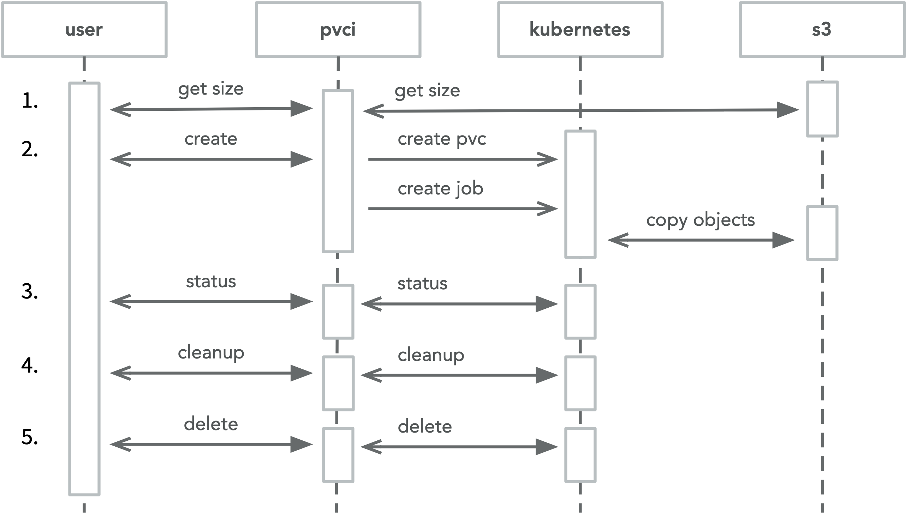

## PVCi: Persistent Volume Claim (S3 Object) Injector

PVCI runs as a web service in a Kubernetes cluster and exposes an API for creating [PersistentVolumeClaims](https://kubernetes.io/docs/concepts/storage/persistent-volumes/) populated with objects from an S3 compatible ([Minio](https://min.io/) or AWS) storage system.

## Overview



## API

1. **POST** body for `/size`:
```json
{
    "s3_ssl": false,
    "s3_endpoint": "obj-service.data:9000",
    "s3_bucket": "datasets",
    "s3_prefix": "testset",
    "s3_key": "{{DEV_OBJ_KEY}}",
    "s3_secret": "{{DEV_OBJ_SECRET}}"
}
```


2. **POST** body for `/create`:
```json
{
    "s3_ssl": false,
    "s3_endpoint": "obj-service.data:9000",
    "s3_bucket": "datasets",
    "s3_prefix": "testset",
    "s3_key": "{{DEV_OBJ_KEY}}",
    "s3_secret": "{{DEV_OBJ_SECRET}}",
    "namespace": "default",
    "storage_class": "rook-ceph-block",
    "name": "test-dataset-1"
}
```


3. **POST** body for `/status`:
```json
{
    "namespace": "default",
    "name": "test-dataset-1"
}
```

4. **POST** body for `/cleanup`:
```json
{
    "namespace": "default",
    "name": "test-dataset-1"
}
```

5. **POST** body for `/delete`:
```json
{
    "namespace": "default",
    "name": "test-dataset-1"
}
```

## Kubernetes Deployment

### RBAC
```yaml
apiVersion: v1
kind: ServiceAccount
metadata:
  name: pvci
  namespace: namespace_a
---
kind: Role
apiVersion: rbac.authorization.k8s.io/v1
metadata:
  name: pvci
  namespace: namespace_b
rules:
  - apiGroups:
      - ""
      - batch
    resources:
      - jobs
      - pods
      - persistentvolumeclaims
    verbs:
      - create
      - delete
      - deletecollection
      - get
      - list
      - patch
      - update
      - watch
---
# create a binding in namespace_a
# between the pvci service account in namespace_a
# and the pvci role in namespace_b
apiVersion: rbac.authorization.k8s.io/v1
kind: RoleBinding
metadata:
  name: pvci-lab
  namespace: namespace_b
roleRef:
  apiGroup: rbac.authorization.k8s.io
  kind: Role
  name: pvci
subjects:
  - kind: ServiceAccount
    name: pvci
    namespace: namespace_a
```
### Service
```yaml
apiVersion: v1
kind: Service
metadata:
  name: pvci
  namespace: namespace_a
  labels:
    app: pvci
    component: api
spec:
  selector:
    app: pvci
  ports:
    - name: http-int
      protocol: "TCP"
      port: 8070
      targetPort: http-api
  type: ClusterIP
```
### Deployment
```yaml
apiVersion: apps/v1
kind: Deployment
metadata:
  name: pvci
  namespace: namespace_a
  labels:
    app: pvci
    component: api
spec:
  replicas: 1
  selector:
    matchLabels:
      app: pvci
  template:
    metadata:
      labels:
        app: pvci
        component: api
    spec:
      serviceAccountName: pvci
      containers:
        - name: pvci
          image: txn2/pvci:0.0.3
          imagePullPolicy: IfNotPresent
          env:
            - name: IP
              value: "0.0.0.0"
            - name: PORT
              value: "8070"
            - name: MODE
              value: "release" # "release" for prod
          ports:
            - name: http-api
              containerPort: 8070
            - name: http-mtx
              containerPort: 2112
```


## Development

### Release
```bash
goreleaser --skip-publish --rm-dist --skip-validate
```

```bash
GITHUB_TOKEN=$GITHUB_TOKEN goreleaser --rm-dist
```
